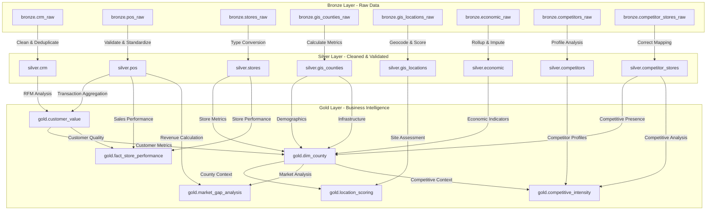

# 📙 Gold Layer Data Catalogue

**Project:** Kenya Retail Location Optimization System
**Layer:** Gold (Business & Analytics Ready)
**Version:** 1.0
**Date:** December 2025
**Author:** Junior Kevin
**Status:** Active

---

## 📑 Document Control

| Item                | Details                                                 |
| ------------------- | ------------------------------------------------------- |
| Project Name        | Kenya Retail Location Optimization System               |
| Layer               | Gold (Business & Analytics Ready)                       |
| Data Classification | Synthetic – For Learning & Portfolio                    |
| Update Frequency    | Daily / Monthly (table dependent)                       |
| Retention Policy    | 3 Years                                                 |
| Owner               | Analytics & Data Engineering Team                       |
| Contact             | [your-email@example.com](mailto:your-email@example.com) |

---

## 🎯 Purpose & Business Questions

Transform raw operational data into strategic insights that answer key business questions:

| Table                  | Primary Purpose                   | Key Questions Answered                                      |
| ---------------------- | --------------------------------- | ----------------------------------------------------------- |
| customer_value         | Identify valuable customers       | Who are our best customers? Where do they live?             |
| dim_county             | County market analysis            | Where should we expand? Which counties are most attractive? |
| fact_store_performance | Store performance benchmarking    | How do stores perform? Which stores underperform?           |
| location_scoring       | Site selection                    | Where should we open new stores?                            |
| market_gap_analysis    | Market opportunity identification | Where are we under-served?                                  |
| competitive_intensity  | Competitive analysis              | Where is competition strongest?                             |

---

## 🗓️ Data Refresh Schedule

| Frequency | Tables                                                 |
| --------- | ------------------------------------------------------ |
| Daily     | customer_value, fact_store_performance                 |
| Monthly   | dim_county, market_gap_analysis, competitive_intensity |
| As Needed | location_scoring                                       |

---

## 🔗 Complete Data Flow: Bronze → Silver → Gold

### Full Data Pipeline Architecture

## 📊 Overview

The **Gold Layer** contains **business-ready, aggregated, and scored datasets** designed for executive reporting, BI dashboards, and advanced analytics.
It represents the **final consumption layer** of the data warehouse.

**Key Principles**

* Business-aligned metrics
* Aggregated & enriched data
* Scoring & ranking models
* BI-optimized schemas
* Read-heavy, analytics-first design
* Deterministic refresh logic

**Storage Specifications**

* **Database:** `Retail_location`
* **Schema:** `gold`
* **Format:** SQL Server tables & views
* **Compression:** Page compression
* **Consumption:** Power BI / Tableau / SQL Analytics

---

## 📁 Repository Structure

```text
gold_layer/
├── README.md
├── customer_value/
├── dim_county/
├── fact_store_performance/
├── location_scoring/
├── market_gap_analysis/
├── competitive_intensity/
├── scripts/
└── documentation/
```

## 📁 Dataset Inventory

## 1️⃣ Customer Value (`customer_value`)

**Source:** `silver.crm`, `silver.pos`
**Purpose:** Customer valuation using RFM-style scoring

### Business Metrics

* Recency score
* Frequency score
* Monetary score
* Composite customer value score
* Value tier classification

### Schema

| Column               | Type          | Null | Description              |
| -------------------- | ------------- | ---- | ------------------------ |
| customer_id          | NVARCHAR(20)  | NO   | Customer ID              |
| primary_county       | NVARCHAR(50)  | YES  | Dominant county          |
| recency_days         | INT           | YES  | Days since last purchase |
| frequency_score      | INT           | YES  | Purchase frequency score |
| monetary_value_kes   | DECIMAL(18,2) | YES  | Total spend              |
| customer_value_score | INT           | NO   | Composite score (0–100)  |
| value_tier           | NVARCHAR(20)  | NO   | Low / Medium / High      |
| load_timestamp       | DATETIME      | NO   | Load time                |

---

## 2️⃣ County Dimension (`dim_county`)

**Source:** `silver.gis_counties`, `silver.economic`, `silver.stores`
**Purpose:** County-level market attractiveness profiling

### Business Metrics

* Population & density
* Poverty & unemployment rates
* Urbanization rate
* Store penetration
* Final location score

### Schema

| Column               | Type          | Description         |
| -------------------- | ------------- | ------------------- |
| county_id            | NVARCHAR(50)  | County ID           |
| county_name          | NVARCHAR(50)  | County name         |
| population           | INT           | Population          |
| urbanization_rate    | DECIMAL(5,2)  | Urban %             |
| store_count          | INT           | Existing stores     |
| population_per_store | DECIMAL(18,2) | Saturation metric   |
| final_location_score | INT           | Score (0–100)       |
| expansion_priority   | NVARCHAR(20)  | High / Medium / Low |
| load_timestamp       | DATETIME      | Load time           |

---

## 3️⃣ Store Performance Fact (`fact_store_performance`)

**Source:** `silver.pos`, `silver.stores`

**Purpose:** Store-level sales and efficiency analysis

### Business Metrics

* Revenue
* Transactions
* Average basket size
* Efficiency score

### Schema

| Column            | Type          | Description         |
| ----------------- | ------------- | ------------------- |
| store_id          | NVARCHAR(50)  | Store ID            |
| county            | NVARCHAR(50)  | County              |
| total_revenue_kes | DECIMAL(18,2) | Revenue             |
| transaction_count | INT           | Transactions        |
| avg_basket_kes    | DECIMAL(18,2) | Avg basket          |
| efficiency_score  | INT           | Score (0–100)       |
| performance_band  | NVARCHAR(20)  | High / Medium / Low |
| load_timestamp    | DATETIME      | Load time           |

---

## 4️⃣ Location Scoring (`location_scoring`)

**Source:** `silver.gis_locations`, `silver.gis_counties`, `silver.economic`

**Purpose:** New store site evaluation

### Business Metrics

* Population proximity
* Economic strength
* Competition proximity
* Composite location score

### Schema

| Column               | Type          | Description           |
| -------------------- | ------------- | --------------------- |
| location_id          | NVARCHAR(50)  | Location ID           |
| county               | NVARCHAR(50)  | County                |
| latitude             | DECIMAL(10,6) | Latitude              |
| longitude            | DECIMAL(10,6) | Longitude             |
| opportunity_score    | INT           | Opportunity (0–100)   |
| risk_score           | INT           | Risk (0–100)          |
| final_location_score | INT           | Composite score       |
| recommendation       | NVARCHAR(20)  | Open / Review / Avoid |
| load_timestamp       | DATETIME      | Load time             |

---

## 5️⃣ Market Gap Analysis (`market_gap_analysis`)

**Source:** `silver.pos`, `silver.gis_counties`, `silver.stores`

**Purpose:** Identify under-served counties

### Schema

| Column               | Type         | Description   |
| -------------------- | ------------ | ------------- |
| county               | NVARCHAR(50) | County        |
| population           | INT          | Population    |
| store_count          | INT          | Stores        |
| expected_store_count | INT          | Expected      |
| market_gap           | INT          | Gap           |
| opportunity_score    | INT          | Score (0–100) |
| load_timestamp       | DATETIME     | Load time     |

---

## 6️⃣ Competitive Intensity (`competitive_intensity`)

**Source:** `silver.competitors`, `silver.competitor_stores`

**Purpose:** Competitive pressure assessment

### Schema

| Column                      | Type          | Description         |
| --------------------------- | ------------- | ------------------- |
| county                      | NVARCHAR(50)  | County              |
| competitor_store_count      | INT           | Competitor stores   |
| competition_density         | DECIMAL(18,2) | Density             |
| competitive_intensity_score | INT           | Score (0–100)       |
| competition_band            | NVARCHAR(20)  | Low / Medium / High |
| load_timestamp              | DATETIME      | Load time           |

---

## 🔗 Data Relationships

| Gold Table             | Grain     | Key Relationships                 |
| ---------------------- | --------- | --------------------------------- |
| customer_value         | Customer  | customer_id → silver.crm          |
| dim_county             | County    | county_name → silver.gis_counties |
| fact_store_performance | Store-Day | store_id → silver.stores          |
| location_scoring       | Location  | county → dim_county               |
| market_gap_analysis    | County    | county → dim_county               |
| competitive_intensity  | County    | county → dim_county               |

---

## ⚙️ ETL Process

* **Procedure:** `gold.usp_LoadGoldLayer`
* **Frequency:** Mixed (daily & monthly)
* **Load Type:** Full refresh with deterministic logic
* **Dependencies:** Silver layer completion

```text
Silver → Aggregation → Scoring → Gold
```
## 📈 Performance Metrics

| Metric            | Target  | Status     |
| ----------------- | ------- | ---------- |
| Data Accuracy     | >99%    | ✅ Achieved |
| Refresh SLA       | <10 min | ✅ Achieved |
| BI Query Response | <2 sec  | ✅ Achieved |

---    

## 📋 Change Log

| Date       | Version | Description                |
| ---------- | ------- | -------------------------- |
| 2025-12-19 | 1.0     | Initial Gold layer release |

---

**End of Gold Layer Data Catalogue**
